# (STEP 14) PROJECT 6: Web Solution With WordPress.

*In this project you will be tasked to prepare storage infrastructure on two Linux servers and implement a basic web solution using WordPress. WordPress is a free and open-source content management system written in PHP and paired with MySQL or MariaDB as its backend Relational Database Management System (RDBMS).*

Project 6 consists of two parts:

* Configure storage subsystem for Web and Database servers based on Linux OS. The focus of this part is to give you practical experience of working with disks, partitions and volumes in Linux.*

* Install WordPress and connect it to a remote MySQL database server. This part of the project will solidify your skills of deploying Web and DB tiers of Web solution.

### **Three-tier Architecture**

*Generally, web, or mobile solutions are implemented based on what is called the Three-tier Architecture.*

*Three-tier Architecture is a client-server software architecture pattern that comprise of 3 separate layers.*

1. **Presentation Layer (PL)**: This is the user interface such as the client server or browser on your laptop.

2. **Business Layer (BL)**: This is the backend program that implements business logic. Application or Webserver

3. **Data Access or Management Layer (DAL)**: This is the layer for computer data storage and data access. Database Server or File System Server such as FTP server, or NFS Server

   

*In this project, we will have the hands-on experience that showcases Three-tier Architecture while also ensuring that the disks used to store files on the Linux servers are adequately partitioned and managed through programs such as gdisk and LVM respectively.*

*We will be working working with several storage and disk management concepts.*

Your 3-Tier Setup;
1. A Laptop or PC to serve as a client
2. An EC2 Linux Server as a web server (This is where you will install WordPress)
3. An EC2 Linux server as a database (DB) server
Use RedHat OS for this project

**Note**: for Ubuntu server, when connecting to it via SSH/Putty or any other tool, we used ubuntu user, but for RedHat you will need to use ec2-user user. Connection string will look like ec2-user@<Public-IP>

Let us get started!

## LAUNCH AN EC2 INSTANCE THAT WILL SERVE AS “WEB SERVER”.

Create an EC2 Linux Server as a web server (This is where we will install Wordpress). We will use Red Hat for the project.

Go to AWS account and click on Launch Instance.

Name the Instance – PBL Project_6.

Under Application and OS Images select Red Hat.

You can use an existing Key Pair. In our case we will use PBL Project 5.

You can create a new security group or use an existing security group. In our case we will use an existing security group that has All traffic under type, All under Protocol and Port Range. One of Source should be 0.0.0.0/0 and the other should be ::/0

Change Number of Instances to 2 as we need 2 instances.

Click Launch Instance.

Click on View all Instances.

The 2 Instances are running.

You can rename them to *PBL project 6 Web Server* and *PBL Project 6 Database Server.*

Availability Zone (AZ) of the 2 servers should be the same . It shows us-east-2b for both.

### Step 1
After launching an EC2 instance that will serve as "Web Server", Create 3 volumes in the same AZ as your Web Server EC2, each of 10 GiB.

* Go to EC2 and click on Volumes.

  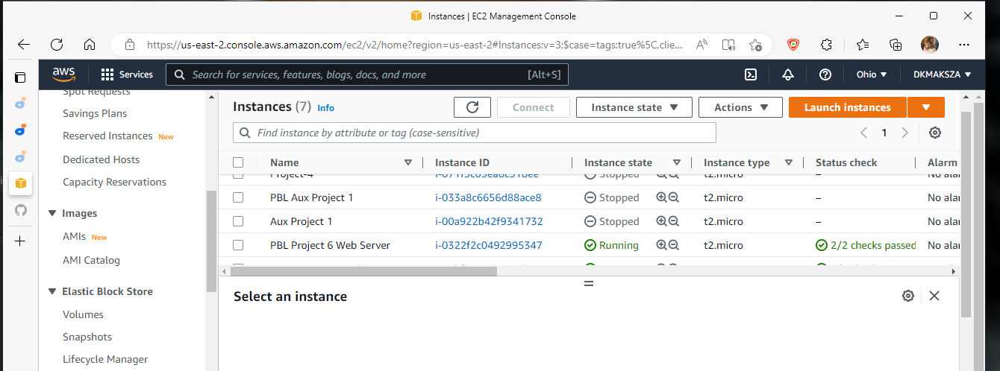

* The screen below will be displayed.

  

* Click on Create Volume.

  

* The screen below will be displayed.

  

* Change Size to 10 GiB and Availability Zone to us-east-2b 

  

* Click on Create Volume.

  

* Refresh the browser. The New Volume created will show available. It will also show the date and the exact time you created it.

  

 * Rename it to PBL Project 6 Web 1.

   

* Follow the same steps and create 2 additinal Volumes and rename them PBL Project 6 Web 2 and PBL Project 6b Web 3 respectively. Remember to refresh the browser once you have created the volumes.

  

* Go back to the instance and connect to PBL Project 6 Web Server.

  

### Step 2

Attach all three volumes one by one to your Web Server EC2 instance.

* Go to Instances
* Select Volumes
* Select PBL Project 6 Web 1 volume.
* Click on Actions
* Attach volume

  

* Remember to select the instance for PBL Project 6 Web Server.

  

* Repeat the same process and attach PBL Project 6 Web 2 and PBL Project 6 Web 3. First refresh the browser.

* Go back to the instance and connect through the terminal for the web server (PBL Project 6 Web Server) and run the command `lsblk`. It will show attached volumes.

  

### Step 3
Open up the Linux terminal to begin configuration.

Use `lsblk` command to inspect what block devices are attached to the server. Notice names of your newly created devices. All devices in Linux reside in /dev/ directory. Inspect it with `ls /dev/` and make sure you see all 3 newly created block devices there – their names will likely be *xvdf, xvdh, xvdg*.

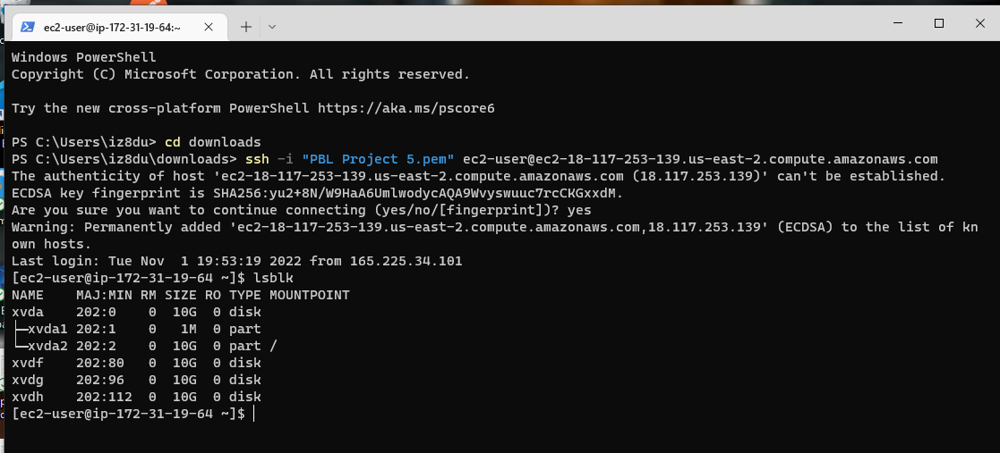

Use `df -h` command to see all mounts and free space on your server.

Use gdisk utility to create a single partition on each of the 3 disks. Do this one disc at a time.

`sudo gdisk /dev/xvdf`

Once you run the command you will be prompted for command (? for help): put n and then enter.

Then under partition number put 1 and enter.

Click enter because we want to use the entire disc. Click enter again to use the entire disc.

We want to change the current type from Linux filesystem to logical Volume Management. Therefore enter 8e00.

Enter command p to check what we have done.

Enter w to write and then Yes.

It will show that that the operation has completed successfully.

Repeat the process by running the command below.

`sudo gdisk /dev/xvdg`

Once you run the command you will be prompted for command (? for help): put n and then enter.

Then under partition number put 1 and enter.

Click enter because we want to use the entire disc. Click enter again to use the entire disc.

We want to change the current type from Linux filesystem to logical Volume Management. Therefore enter 8e00.

Enter command p to check what we have done.

Enter w to write and then Yes.

It will show that that the operation has completed successfully.

Repeat the process again by running the command below.

`sudo gdisk /dev/xvdh`

Once you run the command you will be prompted for command (? for help): put n and then enter.

Then under partition number put 1 and enter.

Click enter because we want to use the entire disc. Click enter again to use the entire disc.

We want to change the current type from Linux filesystem to logical Volume Management. Therefore enter 8e00.

Enter command p to check what we have done.

Enter w to write and then Yes.

It will show that that the operation has completed successfully.

### Step 4

Use `lsblk` utility to view the newly configured partition on each of the 3 disks.

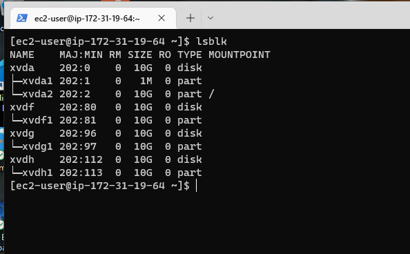

### Step 5

Install lvm2 package using `sudo yum install lvm2`. 

Click Y when prompted.

If you want to confirm that it is installed then run the command `which lvm`.

Run `sudo lvmdiskscan` command to check for available partitions. It will show 4 available partitions.

**Note:** Previously, in Ubuntu we used apt command to install packages, in RedHat/CentOS a different package manager is used, so we shall use yum command instead.

### Step 6

Use `pvcreate` utility to mark each of 3 disks as physical volumes (PVs) to be used by LVM.

There are 2 ways of doing this. You can run the commands one at time or run one command for all. 

First run;

`sudo pvcreate /dev/xvdf1`

`sudo pvcreate /dev/xvdg1`

`sudo pvcreate /dev/xvdh1`

or 

`sudo pvcreate /dev/xvdf1 /dev/xvdg1 /dev/xvdh1`

We will use the last command that will run the 3 at once.

### Step 7

Verify that your Physical volume has been created successfully by running `sudo pvs`.

### Step 8

Use vgcreate utility to add all 3 PVs to a volume group (VG). Name the VG webdata-vg

`sudo vgcreate webdata-vg /dev/xvdf1 /dev/xvdg1 /dev/xvdh1`

Volume groups adds the logical volumes into one group.

### Step 9

Verify that your VG has been created successfully by running sudo vgs

It will only show one volume instead of 3 .

### Step 10

Use `lvcreate` utility to create 2 logical volumes. **apps-lv (Use half of the PV size), and logs-lv Use the remaining space of the PV size. NOTE:** apps-lv will be used to store data for the Website while, logs-lv will be used to store data for logs.

`sudo lvcreate -n apps-lv -L 14G webdata-vg`

`sudo lvcreate -n logs-lv -L 14G webdata-vg`

### Step 11

Verify that your Logical Volume has been created successfully by running `sudo lvs`

### Step 12

Verify the entire setup

`sudo vgdisplay -v #view complete setup - VG, PV, and LV`

`sudo lsblk`

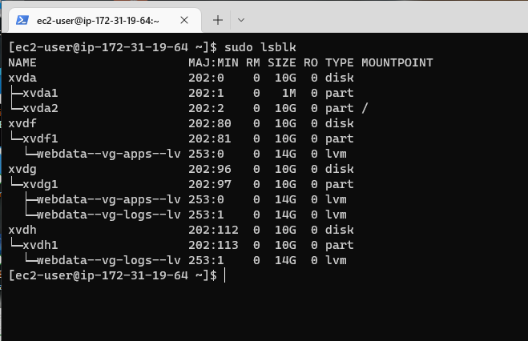

### STep 13

Use mkfs.ext4 to format the logical volumes with ext4 filesystem

`sudo mkfs -t ext4 /dev/webdata-vg/apps-lv`

`sudo mkfs -t ext4 /dev/webdata-vg/logs-lv`

### Step 14

Create /var/www/html directory to store website files. P means create the current directory if it does not exist.

`sudo mkdir -p /var/www/html`

To confirm, run `sudo ls -l /var`

### Step 15

Create */home/recovery/logs* to store backup of log data

`sudo mkdir -p /home/recovery/logs`

### Step 16

Mount */var/www/html* on apps-lv logical volume

`sudo mount /dev/webdata-vg/apps-lv /var/www/html/`

*It is a good practice to first check what is in the directory before you mount as it will replace whatever was in the directory after you mount. You can do this by running the command `ls -l /var/www/html`. It should have nothing , but in our case it will have something because I have just mounted the logical volume.*

If you run `df -h` , it will show that it is mounted.

### Step 17

Use rsync utility to backup all the files in the log directory /var/log into /home/recovery/logs 

(This is required before mounting the file system)

`sudo rsync -av /var/log/. /home/recovery/logs/`

To confirm this, run the command below.

`sudo ls -l /home/recovery/logs`

### Step 18

Mount */var/log* on logs-lv logical volume. (Note that all the existing data on /var/log will be deleted. That is why step 15 above is very
important)

`sudo mount /dev/webdata-vg/logs-lv /var/log`

If you run `ls -l /var/log`, it will show that it is empty.

### Step 19

You now need to copy back the files by restoring lg files back to /var/log directory.

`sudo rsync -av /home/recovery/logs/. /var/log`

To check, run the command below.

`sudo ls -l /var/log`

### Step 20

Update */etc/fstab* file so that the mount configuration will persist after restart of the server.

To check the block id, run `sudo blkid`

The two UUID are diaplayed at the bottom of the output.

Copy the 2 types with the UUID in notepad.

We know that the first one is for apps. Remove the quotes after the = and clear from the end to where it says BLOCk on both as shown below.

Go back to the terminal and run the command below.

`sudo vi /etc/fstab`

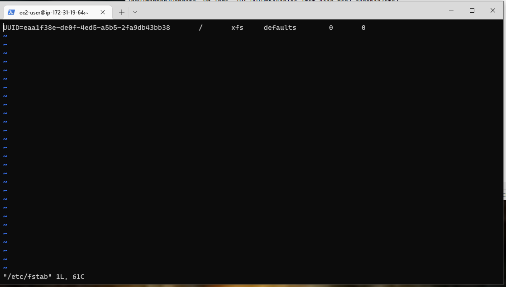

Press i for Insert then comment in the file: # Mount for wordpress webserver.

Go to the notepad and add */var/www/html ext4 defaults 0 0* to the apps ID as shown below.

/dev/mapper/webdata--vg-apps--lv: UUID=ccf3ed93-b726-4d72-9326-e2901a02fb9d /var/www/html ext4 defaults 0 0

 Copy the section below and paste it in the terminal as shown below.

 UUID=ccf3ed93-b726-4d72-9326-e2901a02fb9d /var/www/html ext4 defaults 0 0

 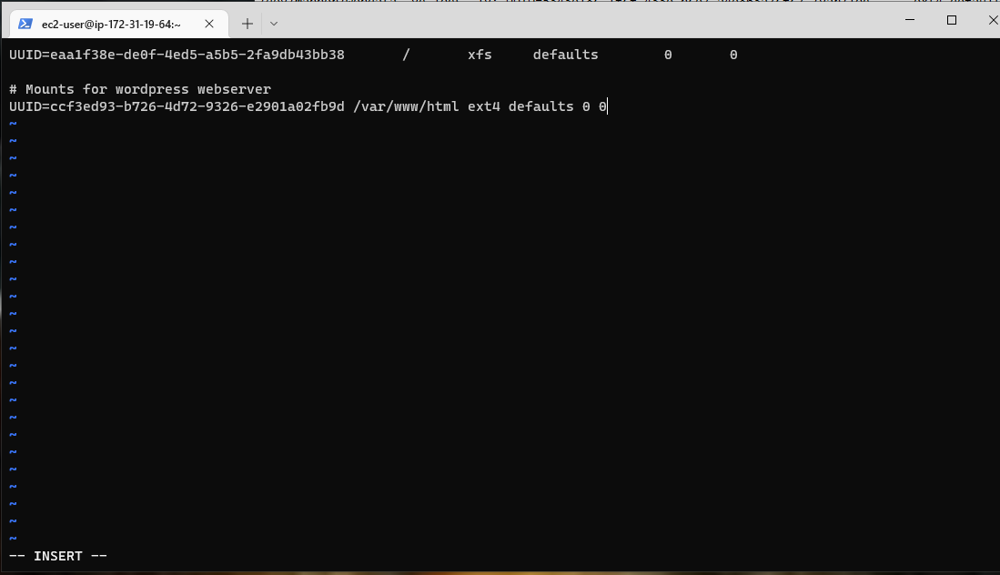

 Press Enter.

 Go back to the notepad and copy the UUID for the logs and paste it in the terminal.

 UUID=5343e18c-1fcf-433e-bce7-a4e863a7cfc7 /var/log      ext4 defaults 0 0

 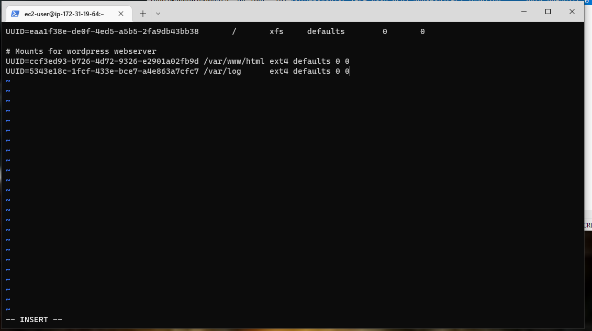

 After editing this file, run `systemctl daemon-reload` to update systemd units generated from this file. This can be commented.

 To save and quit run the command below.

 Esc
 :wqa
 Enter

 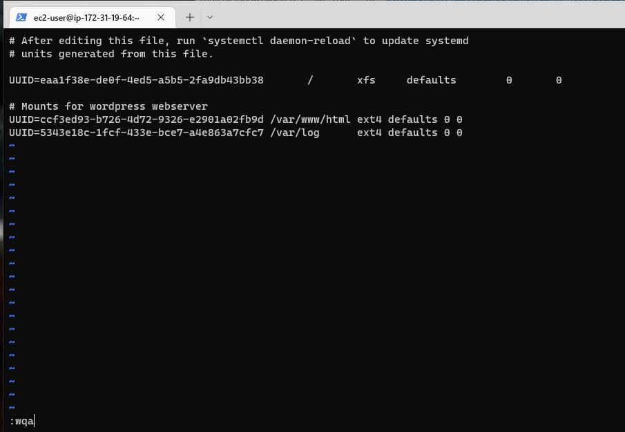

 The screen below will be displayed.

 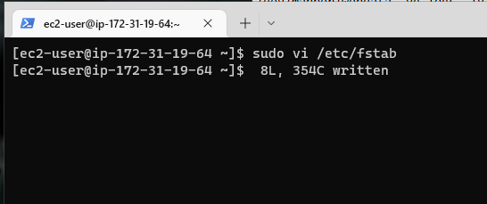

 Run the command `sudo mount -a` to ensure that what we performed was correct.

 

 No error is returned which means that the configuration is successful.

 Reload the daemon.

 `sudo systemctl daemon-reload`

Verify your setup by running `df -h`, output must look like this:

## Phase 2 — Prepare the Database Server

Launch a second RedHat EC2 instance that will have a role – ‘DB Server’
Repeat the same steps as for the Web Server, but instead of *apps-lv* create *db-lv* and mount it to */db* directory instead of */var/www/html/.*

### Step 1 - Create Volumes

Once logged in go to and select PBL Project 6 Database Server and go to volumes.

 Click on Create Volume.

 

Change Size to 10 GiB and Availability Zone to us-east-2b 

Click on Create Volume.

The screen below will be displayed.

Repeat the same process to create the same Volume.

Change Size to 10 GiB and Availability Zone to us-east-2b.

Click Create Volume.

The screen below will be displayed.

Repeat the same process to create the third volume.

Click Create Volume.

Change Size to 10 GiB and Availability Zone to us-east-2b.

Click Create Volume.

The screen below will be displayed.

Click Refresh. Scroll down and you will see the three volumes created. They will be displayed as available.

### Step 2 - Rename Volumes

Select the first Volume and Rename it to PBL Project 6 DB1 as shown below. Save it at the end.

Repeat the same for 2 and 3. It should look like the screen below.

### Step 3 - Attach Volumes

Select on PBL Project 6 DB1. Click on Actions and select attach volumes. 

Under Instance , select PBL Project 6 Database Server. Click Attach.

Click Refresh.

Repeat the same process for PBL Project 6 DB2 and PBL Project 6 DB 3.

PBL Project 6 DB 2

PBL Project 6 DB 3

Click on Refresh.

Click on Instances.

Select PBL Project 6 Databse Server and connect.

### Step 4 - Run lsblk

Run `lsblk`

### Step 5 - Create Single  Partition

Use gdisk utility to create a single partition on each of the 3 disks. Do this one disc at a time.

Run `sudo gdisk /dev/xvdf`

Once you run the command you will be prompted for command (? for help): put n and then enter.

Then under partition number put 1 and enter.

Click enter because we want to use the entire disc. Click enter again to use the entire disc.

We want to change the current type from Linux filesystem to logical Volume Management. Therefore enter 8e00.

Enter command p to check what we have done.

Enter w to write and then Yes.

It will show that that the operation has completed successfully.

Repeat the same process for xvdg.

Run `sudo gdisk /dev/xvdg`

Once you run the command you will be prompted for command (? for help): put n and then enter.

Then under partition number put 1 and enter.

Click enter because we want to use the entire disc. Click enter again to use the entire disc.

We want to change the current type from Linux filesystem to logical Volume Management. Therefore enter 8e00.

Enter command p to check what we have done.

Enter w to write and then Yes.

It will show that that the operation has completed successfully.

Repeat the same process for xvdh.

Run `sudo gdisk /dev/xvdh`

Once you run the command you will be prompted for command (? for help): put n and then enter.

Then under partition number put 1 and enter.

Click enter because we want to use the entire disc. Click enter again to use the entire disc.

We want to change the current type from Linux filesystem to logical Volume Management. Therefore enter 8e00.

Enter command p to check what we have done.

Enter w to write and then Yes.

It will show that that the operation has completed successfully.

Run `lsblk` again to check and make sure that the partitions were created.

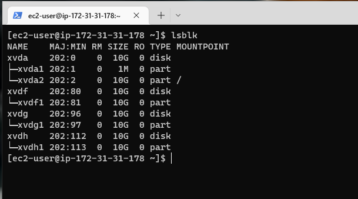

It will show that it was created successfully per the diagram.

### Step 6 - Intall lvm2

Run `sudo yum install lvm2 -y`

### Step 7

Use `pvcreate` utility to mark each of 3 disks as physical volumes (PVs) to be used by LVM.

Run;

`sudo pvcreate /dev/xvdf1 /dev/xvdg1 /dev/xvdh1`

### Step 8

Use vgcreate utility to add all 3 PVs to a volume group (VG). Name the Volume group vg-database.

`sudo vgcreate vg-database /dev/xvdf1 /dev/xvdg1 /dev/xvdh1`

Verify that your VG has been created successfully by running `sudo vgs`.

### Step 9 - Create logical volume (db-lv)

Use `lvcreate` utility to create db-lv logical volume. Give it 20G.

`sudo lvcreate -n db-lv -L 20G vg-database`

To confirm, run `sudo lvs`.

### Step 10 - Create the Mount Point

Create a directory called db.

`sudo mkdir /db`

Before you mount it, you need to create a file system first.Use mkfs.ext4 to format the logical volumes with ext4 filesystem.

Run the command below.

`sudo mkfs.ext4 /dev/vg-database/db-lv`

The next step is to mount. Before we do that, you can go ahead and confirm that nothing exists in the directory we just created by running the command below.

`ls -l /db`

Go ahead and run the command below to mount.

`sudo mount /dev/vg-database/db-lv /db`

Run `df -h` to show that it has been successfully mounted.

### Step 11

Update */etc/fstab* file so that the mount configuration will persist after restart of the server.

To check the block id, run `sudo blkid`

The UUID is diaplayed at the bottom of the output.

Copy the UUID in notepad.

Run the command below;

`sudo vi /etc/fstab`

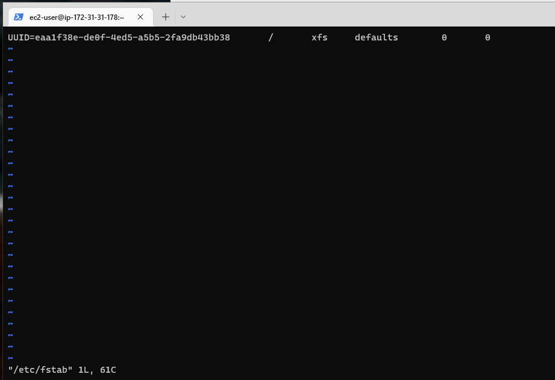

Press i for Insert then comment in the file: # Mount for database.

Go to the notepad and add */db ext4 defaults 0 0* to the apps ID as shown below.

Copy what you have in the notepad and paste it to the terminal.

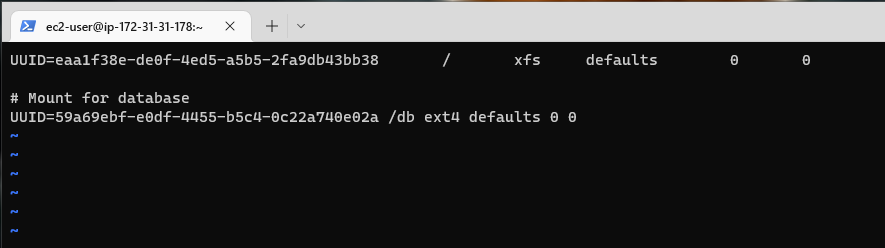

To save and quit run the command below.

Esc :wqa Enter

Run the command `sudo mount -a` to ensure that what we performed was correct.

 

 No error is returned which means that the configuration is successful.

 Reload the daemon.

 `sudo systemctl daemon-reload`

Verify your setup by running `df -h`, output must look like this:

## Phase 3 - Install Wordpress on your Web Server EC2

1. Update the repository.
   Login to the database server and run the below command. 

   `sudo yum -y update`

   

   Login to the web server and run the same command. The installation might take a while.

   `sudo yum -y update`

   

  2. Check Security group.
     
     Go to EC2 and select database server (PBL Project 6 Database Server).

     Select Security > Security Details > Inbound Rules.

     Click Edit Inbound Rules and ensure that all trafic is allowed.

     

     Click Save

     Repeat the same process for the Web Server.

     

     Note that it is the same security group so no changes are needed.

  3. Install wget, Apache and it’s dependencies

     `sudo yum -y install wget httpd php php-mysqlnd php-fpm php-json`

     

  4. To install the latest version of PHP.  First install EPEL repository by running the command below.

     `sudo dnf install https://dl.fedoraproject.org/pub/epel/epel-release-latest-8.noarch.rpm`

     Click Yes when prompted.

     

     

     Next, install yum utils and enable remi-repository using the command below.

     `sudo dnf install dnf-utils http://rpms.remirepo.net/enterprise/remi-release-8.rpm`

     Click Y when prompted.

     

     

     After the successful installation of yum-utils and Remi-packages, search for the PHP modules which are available for download by running the command.

     `sudo dnf module list php`

     

     Click Y when prompted.

     

     Click Y when prompted.

     

     The output indicates that the currently installed version of PHP is PHP 7.2. To install the newer release, PHP 8.0, reset the PHP modules.

     `sudo dnf module reset php`

     

     Click Y when prompted.

     Having reset the PHP modules, enable the PHP 8.0 module by running.

     `sudo dnf module enable php:remi-8.0`

     

     Click Y when prompted.

     Finally, install PHP, PHP-FPM (FastCGI Process Manager) and associated PHP modules using the command.

     `sudo dnf install php php-opcache php-gd php-curl php-mysqlnd`

     You will be prompted 3 times to select Y or . Select Y.

     

     verify the version installed,run.

      `php -v `

     

     We now have PHP 8.0 installed. Equally important, we need to start and enable PHP-FPM on boot-up.

     `sudo systemctl start php-fpm`

     

     `sudo systemctl enable php-fpm`

     

     To check its status execute the command;

     `sudo systemctl status php-fpm`

     

     To instruct SELinux to allow Apache to execute the PHP code via PHP-FPM run;

     `sudo setsebool -P httpd_execmem 1`

     

  5. Finally, restart Apache web server for PHP to work with Apache web server.

     `sudo systemctl restart httpd`

     

     You can check the status by running the command below.

     `sudo systemctl status httpd`

     

     It shows that it is active and running.

     Get the public IP from the web server.

     18.216.169.86

     Paste the IP on the web and the screen belpow will be displayed showing that the apache is working fine.

     

  6. Download wordpress and copy wordpress to var/www/html

     Run `mkdir wordpress`

     

     Change directory to wordpress.

     `cd wordpress`

     

     Download wordpress.

     `sudo wget http://wordpress.org/latest.tar.gz`

     

     Run `ls -l`. It will show that we have the latest star.

     

     Extract wordpress by running the command below.

     `sudo tar xzvf latest.tar.gz`

     

     Run `ls -l`. It will show that an extract called wordpress has been created.

     

     Change directory into wordpress.

     `cd wordpress`

     

     Run `ls -l`. It will display everything in the wordpress directory.

     

     Run the command below to create wp-config.php and then copy the content of wp-config-sample.php to wp-config.php.

     `sudo cp -R wp-config-sample.php wp-config.php`

     

     Run `cat wp-config.php`

     

     Run the command below to copy wordpress to var/www/html.

     `sudo cp -R wordpress /var/www/html/`

     

     Change directory to /var/www/html.

     `cd /var/www/html`

     

     Run `ls -l`

     

     This is not supposed to be the case so we will remove the copy we just did by running the command below.

     `sudo rm -rf wordpress/`

     

      Also remove lost + found

      `sudo rm -rf lost+found/`

      

      Run `ls -l`

      

      It will show that there is nothing now.

      Change directory by running `cd ../..`

       

       Run `cd`

       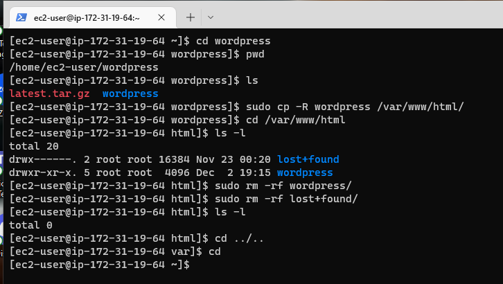

       Run `ls`

       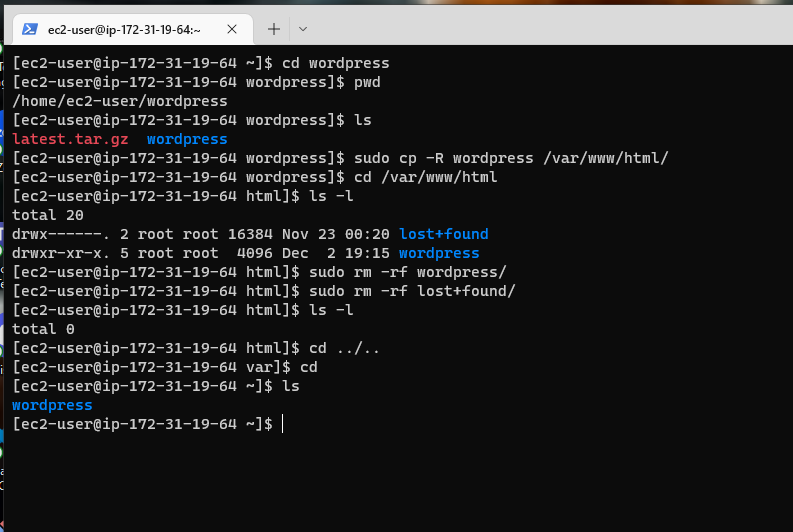

       Change directory to wordpress.

       `cd wordpress`

       

       Run `ls`

       

      To see the contents of wordpress, run the command below.

      `ls -l wordpress`

       

       We do not want to copy the wordpress folder. We would like to open the folder and copy the contents to /var/www/html/.

       `sudo cp -R wordpress/. /var/www/html/`

       

       To confirm that the contents were copied to /var/www/html/, run the command below.

       `sudo ls -l /var/www/html/`

       

       Change directory to /var/www/html

       `cd /var/www/html`

       

       Run `ls` 

       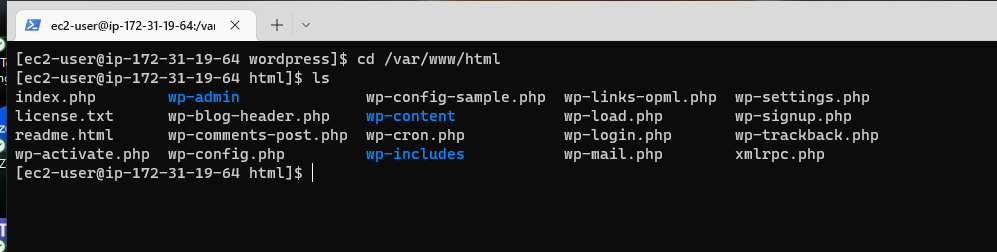

  6. Install mysql on the web server.
      
      The webserver will be acting as a client , therefore we will need to install my sql.

     Run the command below.

     `sudo yum install mysql-server`

     

     Click yes when prompted.

     

     We will do the same installation to the database server also to ensure that the web server can talk to the database server.

    
    
7. Login to the database server through the terminal.

   

   Run the command below.

     `sudo yum install mysql-server`

     

     Click yes when prompted.

     

  8. Switch back to the web server and run the command below to start the service for mysql. Make sure you are in the hmtl directory as shown.

     `sudo systemctl start mysqld`

     

     Enable the service by the command below.

     `sudo systemctl enable mysqld`

     

     Now check the status.

     `sudo systemctl status mysqld`

     

     It shows that the service is running.

 9. Go back to the database server or log back in if you were logged out.

    

    Start mysql server in  database server.

    `sudo systemctl start mysqld`

    

    Enable mysql server in database server.

    `sudo systemctl enable mysqld`

    

    Check the status of mysql server.

    `sudo systemctl status mysqld`

    

10. To set the password, run the command below.

     `sudo mysql_secure_installation`

     

     Press n when prompted for either y/n

     When prompted  give it a simple password like `password` and enter. You will need to re-enter the password.

     

     Press y for all the promptings

     

     

  12. Login to mysql using the password (password) through the command below.

      `sudo mysql -u root -p`

        

       

  13. Create database named wordpress.

      `create database wordpress;`

      

      To show the database, run the command below.

      `show databases;`

      

  13. Create a database user.

       `CREATE USER 'wordpress'@'%' IDENTIFIED WITH mysql_native_password BY 'wordpress';`

      *% means it can connect from any where. Normally you could just put the IP address of the web server only for security , but in our case we want it to connect from anywhere.*

      We have selected the password to be *wordpress*

      

  14. Grant Priviledges to the database user.

       `GRANT ALL PRIVILEGES ON *.* TO 'wordpress'@'%' WITH GRANT OPTION;`

       The first * means database and the second * means tables.

       

       Run `flush privileges`

       

       Confirm that the database user has been created.

       `select user, host from mysql.user;`

       

      Run `exit;`

       

  15. Set the Bind address.

       `sudo  vi /etc/my.cnf`

       

       Under !includedir /etc/my.cnf.d add what is shown below.

       Click i for Insert and type the 2 below lines

       [mysqld]
       bind-address=0.0.0.0

       0.0.0.0 means from any IP address

       To save and quit;

       Click ESC

       :wqa!

       Enter

       

       Restart the service.

       `sudo systemctl restart mysqld`

       

  16. Go back to the web server and open the config.php file.

      `sudo vi wp-config.php`

       

  17.  Edit config.php file as shown below.

       Click i for Insert.

       Next to define ( 'DB_NAME', change database_name_here with 'wordpress'). 

       Change the DB password with 'wordpress'

       Get the Private IP address of the database and replace local host with it.You can use it because the web server and the database server reside in the same subnet.

       172.31.31.178

       

       To save and quit;

       Click ESC

       :wqa!

       Enter

       

  18. Restart the web service.

       `sudo systemctl restart httpd`

       

  19. We need to disable the default test page of apache.

      `sudo mv /etc/httpd/conf.d/welcome.conf /etc/httpd/conf.d/welcome.conf_backup`

      

  20. Test that you can connect from your Web Server to your DB server by using mysql-client.

      `sudo mysql -h 172.31.31.178 -u wordpress -p`

      Enter wordpress for password.

      

      The screenshot above shows that the connection was successful.

      Verify if you can successfully execute SHOW DATABASES; command and see a list of existing databases.

      

      Exit;

      Change permissions and configuration so Apache could use WordPress:

      `sudo chown -R apache:apache /var/www/html/`

      

      Run `ls -l`

      

      Another change permissions.

      `sudo chcon -t httpd_sys_rw_content_t /var/www/html/ -R`

      

      For connection run these last 2 commands. ;

      `sudo setsebool -P httpd_can_network_connect=1`

      

      This last one if for DB.

      `sudo setsebool -P httpd_can_network_connect_db 1`

      

  21. Log to the browser through the link below.

      http://3.135.237.19/wp-admin/install.php

      

      Click Continue at the bottom.

      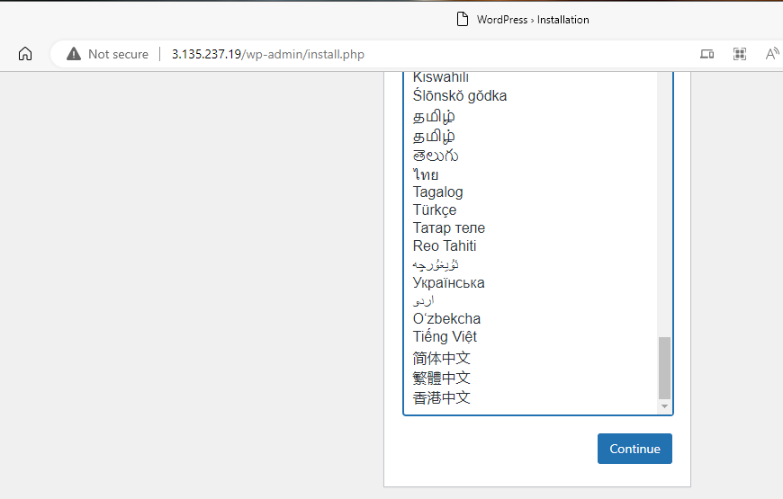

      Fill your credentials as shown below.

      

      Below is the password.

      !WmoTp(Y9nVre7yZY3

      Click Install wordpress.

      

       Click login and use your credentials.

       

       

       Complete

      

       

    

     

     

